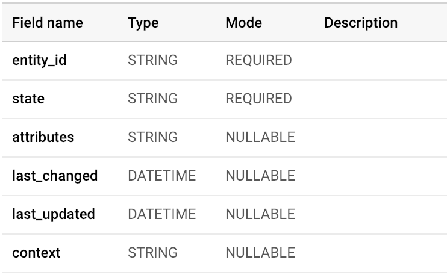

# Home Assistant Pub/Sub cloud function

This is a Google Cloud Function that hooks into a Pub/Sub topic where [Home Assistant states](https://www.home-assistant.io/docs/configuration/state_object/) are published.

The cloud function will write each event to a [Google BigQuery](https://console.cloud.google.com/bigquery) table. 

1. Use [this documentation](https://cloud.google.com/bigquery/docs/tables#bigquery-create-table-web) to create your table. Use the following table structure:

2. Fill in `DATASET` and `TABLE` in `main.py`
3. Make sure you have the `gcloud` cli installed: [https://cloud.google.com/sdk/](https://cloud.google.com/sdk/)
4. Use this command to deploy the Cloud Function
```bash
gcloud functions deploy hass_to_bigquery --runtime python37 --trigger-topic topic-name
```
Replace `topic-name` with the topic name you use in Home Assistant to publish to Pub/Sub

That's it! Your events should start appearing in BigQuery.
